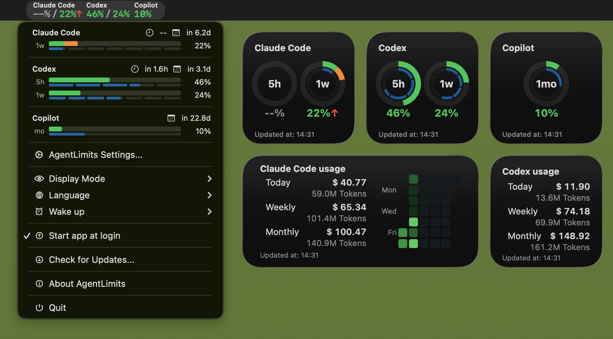

# AgentLimits

**開発中**

macOS Sonoma以降向けのアプリと通知センターウィジェットで、ChatGPT Codex / Claude Code の使用制限（5時間・週）を表示します。

## 最新版ダウンロード
最新版はこちらからダウンロードしてください: [ダウンロード](https://github.com/Nihondo/AgentLimits/releases/latest/download/AgentLimits.zip)

## 機能概要

### 使用量モニタリング
- アプリ内WKWebViewで対象サービスにログイン（Codex/Claudeを切替）
- 使用量は内部APIから自動取得:
  - Codex: `https://chatgpt.com/backend-api/wham/usage`（JSON）
  - Claude: `https://claude.ai/api/organizations/{orgId}/usage`（JSON）
- App Group `group.com.(your domain).agentlimit` にプロバイダ別スナップショット保存
- Codex用 / Claude用の別ウィジェットとして表示
- 自動更新: アプリ起動中は1分ごと（ログイン済みのサービスのみ）

### Wake Up（CLIスケジューラ）
- 指定した時刻にCLIコマンド（`codex exec "Hello"` / `claude -p "Hello"`）を自動実行
- LaunchAgentで実装（macOS標準の定期実行機能）
- プロバイダ別にスケジュール設定可能
- 追加の引数（例: `--model="haiku"`）を設定可能`
- **何のための機能？** 9時からセッションを開始して、12時には使い切ってしまい14時まで何もできなくなるケースがよくあります。その場合、7時にセッションを開始しておけば、12時にはセッションがリセットされて再び利用できるようになります。

### 閾値通知
- 使用量が閾値を超えると通知センターに警告を表示
- プロバイダ別（Codex / Claude）に設定可能
- ウィンドウ別（5時間 / 週）に設定可能
- デフォルト閾値: 90%
- 同じリセットサイクル内では1回のみ通知（重複防止）

## 基本の使い方
1. AgentLimitsアプリを実行
2. 通知センターでウィジェットを追加
3. メニューバーのアイコンから「AgentLimits設定...」を選ぶ
4. 画面上部でCodex/Claudeを切り替える
5. 画面下部のWebViewで対象サービスにログイン
6. メニューバーの「表示モード」から使用量/残り使用量を切り替える
7. 「今すぐ更新」は選択中のサービスのみ更新します

### Wake Up設定
1. メニューバーから「Wake up設定...」を選択
2. プロバイダを選択（Codex / Claude Code）
3. 「スケジュールを有効にする」をオン
4. 実行したい時刻（0〜23時）を選択
5. 「今すぐテスト実行」でCLI動作を確認

### 閾値通知設定
1. メニューバーから「閾値通知設定...」を選択
2. 通知権限をリクエスト（初回のみ）
3. プロバイダを選択（Codex / Claude Code）
4. 5時間/週間のそれぞれで閾値を設定

## 表示内容
- 5時間の使用率（%）または残り（%）
- 週あたりの使用率（%）または残り（%）
- 最終更新（相対表示）
- 表示モードはメニューバーから設定（アプリ/ウィジェット共通）

## 注意
- 取得は内部APIに依存します。仕様変更で取得できなくなる可能性があります。
- Widgetの更新頻度はOSにより間引かれる場合があります。
- 閾値通知には通知権限が必要です。
