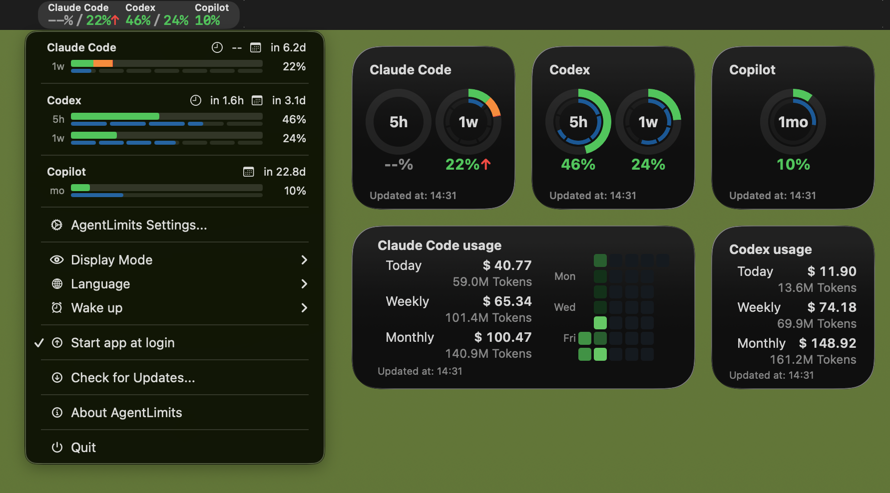
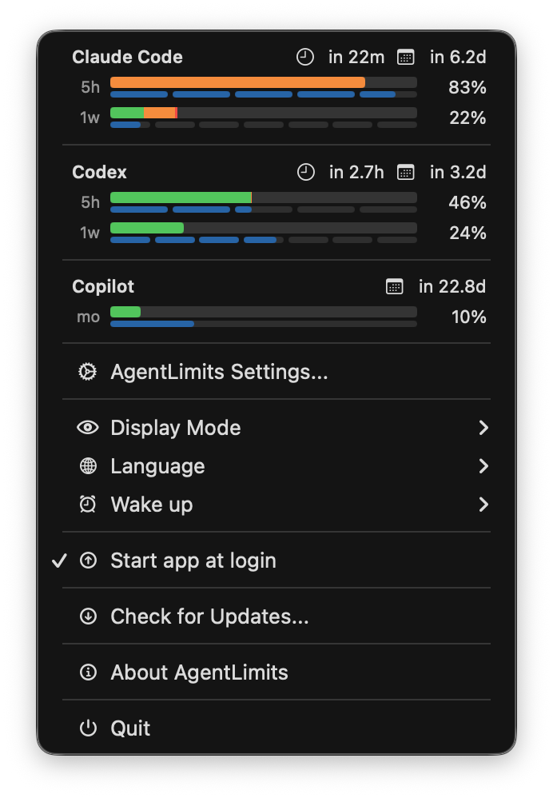

# AgentLimits

**開発中**

macOS Sonoma以降向けのメニューバーアプリと通知センターウィジェットで、ChatGPT Codex / Claude Code の使用量（5時間+週、またはプロバイダが月間ウィンドウを返す場合は月間）、GitHub Copilot の使用量（月間プレミアムリクエスト）、ccusage のトークン使用量を表示します。



## ダウンロード
最新版はこちらからダウンロードしてください: [ダウンロード](https://github.com/Nihondo/AgentLimits/releases/latest/download/AgentLimits.zip)

## クイックスタート（初回セットアップ）
1. AgentLimitsアプリを起動
2. 通知センターでウィジェットを追加
3. メニューバーから **AgentLimits設定...** を開く
4. **使用量**タブで Codex / Claude Code / Copilot を選び、更新間隔（1〜10分）を設定し、画面下部のログインバー（`▲`）を開いてログイン
5. メニューバーの **表示モード** で「使用/残り」を切り替え、必要に応じて **今すぐ更新**

## 取得する情報
- **使用量（Codex / Claude Code）**: 5時間+週、またはプロバイダが月間ウィンドウを返す場合は月間の使用量を内部APIから取得
  - Codexが一時的に週次ウィンドウだけを返す場合、5時間枠は未取得のまま、返された値を週次枠に表示します
  - Codex: `https://chatgpt.com/backend-api/wham/usage`
  - Claude Code: `https://claude.ai/api/organizations/{orgId}/usage`
- **使用量（GitHub Copilot）**: 月間プレミアムリクエスト枠をentitlement APIから取得
  - Copilot: `https://github.com/github-copilot/chat/entitlement`
- **カスタム使用量サービス**: ユーザーが選択した実行可能ファイルを起動し、stdoutへ出力されたAgentLimits形式のJSONスナップショットを取得します。各サービスは重複しない `5h`、`1w`、`1month` のうち1〜2枠を提供できます。
- **トークン使用量（ccusage）**: CLIで日/週/月のトークン数とコストを取得
  - Codex: `npx -y ccusage@latest codex daily`
  - Claude Code: `npx -y ccusage@latest claude daily`
  - 実行コマンドは設定画面でプロバイダごとに編集可能です。複数マシンの使用量を集約するような、ccusage互換の独自スクリプトに差し替えられます。コマンド内で `{{since}}` を使うと当月初日に置き換えられます。空欄のままにするとデフォルトのコマンドが使われます。
- **プレミアムリクエスト使用量（Copilot）**: WebView経由で日別のプレミアムリクエスト数とコストを取得
  - API: `https://github.com/settings/billing/usage_table`（Copilot使用量の取得時に自動取得）

## メニューバー表示
- アイコンエリアにプロバイダごとに2行表示
  - 1行目: サービス名
  - 2行目: `X% / Y%`（5時間 / 週）
  - Copilotや一部のCodexプランなど月間のみの場合は `X%`（月間）
- 表示モード: **使用率** / **残り率**（アプリとウィジェットで共通）
- 色分け: ペースメーカー比較に基づく表示（色は **通知** タブで設定）
- メニューバー上のステータス色は、現在のメニューバー文字色に合わせて自動的に暗く/明るく補正されます
- ペースメーカー表示: ペース超過時に `↑` を表示
- 表示のオン/オフは **使用量** タブでプロバイダごとに切替
- **メニューバーアイコンを隠す**: アイコンを完全に非表示にできます。非表示中に、起動したままアプリアイコンをダブルクリック（Finder / Spotlight / `open -a AgentLimits`）すると、一時的にアイコンが復活して設定画面が開きます。設定ウィンドウを閉じるとアイコンは再び非表示になります。
- 組み込み・カスタム共通のサービス表示順は **使用量** タブの「**表示順**」でドラッグして並べ替え可能

### メニューダッシュボード
メニューバーアイコンをクリックすると、メニュー上部に各プロバイダーの使用状況ダッシュボードが表示されます：
- ヘッダー: サービス名・5h枠の残り時間・週次リセットまでの日数、または月間のみのプロバイダでは月間リセット
- **使用率バー**: 使用率を線形バーで表示。ペースメーカー超過時はウィジェットのドーナツリングと同じセグメント色分け（緑 → オレンジ → 赤）
- **ペースメーカーバー**: 5h=5分割・週次=7分割・月間=分割なしのセグメントバー。ウィジェットの内側リングと同じ動作
- ダッシュボード行をクリックすると対応サービスの使用状況ページをブラウザで開きます。カスタムサービスは設定済みのHTTP/HTTPS URLを開き、URL未設定ならそのサービスの設定を開きます
- **使用量** タブの「メニューにダッシュボードを表示」でプロバイダごとに表示/非表示を切替可能
- メニューには: **表示モード**・**言語**（システムまたは同梱されている翻訳）・**Wake Upの今すぐ起動**・**ログイン時にアプリを起動**・**アップデートを確認...** も含まれます
- **システム** を選択すると、対応しているOS言語を使用し、OS言語が未対応の場合はEnglishにフォールバックします。



## ペースメーカー
ペースメーカーは、時間経過に基づく使用量の目安を表示し、ペース配分に役立てます。

- **計算方法**: ウィンドウの経過時間割合（例: 50% = 5時間・週の半分が経過）
- **色分け**: 緑 = 目安以下（順調）、オレンジ = やや超過、赤 = 10%以上超過
- **メニューバー**: `<使用率>% (<ペースメーカー>)%` 形式で表示（表示切替は **ペースメーカー** タブ）
- **ウィジェット**: 外側リング = 実際の使用率、内側リング = ペースメーカー値（取得できる場合に表示）
  - **使用率モード時のみ**、ペースメーカー超過時は外側リングを色分けセグメント表示（緑 → オレンジ → 赤で警告/危険範囲を表示、**ペースメーカー** タブで切替可、デフォルトは有効）
- **閾値設定**: 警告・危険の超過閾値は **ペースメーカー** タブで設定可能
- **色設定**: ペースメーカーのリング色・文字色は **ペースメーカー** タブで設定可能

## ウィジェット
### 使用量ウィジェット（Codex / Claude Code）
- ダブルドーナツ: 5時間・週の2つのウィンドウを横並び表示
- Codexが週次ウィンドウだけを返す場合、5時間ドーナツは未取得のまま、週次ドーナツには使用量を表示します
- 一部のCodexプランでは、Codex APIが月間ウィンドウのみを返す場合に月間のシングルドーナツを中央表示
- 使用率と表示モードに応じて色分け表示
- 更新時刻は `HH:mm` 形式（24時間以上前なら `--:--`）

### 使用量ウィジェット（GitHub Copilot）
- シングルドーナツ: 月間プレミアムリクエスト枠を中央配置
- ペースメーカー内側リングは週分割（請求期間に応じて4〜5セグメント）
- 中央ラベル: `1mo`
- 使用率と表示モードに応じて色分け表示
- 更新時刻は `HH:mm` 形式（24時間以上前なら `--:--`）

### カスタム使用量ウィジェット
- 1種類の **カスタム使用量** ウィジェットを追加し、右クリックして **「カスタム使用量」を編集...** からサービスを選択します
- 複数のウィジェットインスタンスで、それぞれ異なるカスタムサービスを選択できます
- 小・中サイズとも `5h` → `1w` → `1month` 順で1〜2枠を表示し、使用量の色、使用率/残り率、ペースメーカー、更新時刻を共通利用します
- 各枠に任意の `label` を指定できます。カスタムラベルはウィジェット、ダッシュボード、通知設定に表示され、ペースメーカーリングは分割されません
- `resetAt` または `durationSeconds` がない枠、または `isPacemakerEnabled: false` の枠は、ペースメーカーリングと比較インジケーターなしで使用量を表示します
- 選択済みサービスを削除すると、サービスを利用できないことを表示します

### トークン使用量ウィジェット（Codex / Claude Code）
- **小サイズ**: 今日 / 今週 / 今月のサマリー（コスト + トークン数）
- **中サイズ**: サマリー + GitHub風ヒートマップ
  - 7行（日〜土）× 4〜6列（週）
  - 四分位に基づく5段階の色濃度
  - 曜日ラベル（Mon, Wed, Fri）表示
  - デスクトップ固定モード対応（アクセント / グレースケール）
- ウィジェットタップ時の動作を設定可能（デフォルトは `https://ccusage.com/` を開く）

### プレミアムリクエスト使用量ウィジェット（GitHub Copilot）
- **小サイズ**: 今日 / 今週 / 今月のサマリー（コスト + プレミアムリクエスト数）
- **中サイズ**: サマリー + GitHub風ヒートマップ
- Copilot使用量の更新時に自動取得（WebView経由、CLI不要）
- ウィジェットタップ時の動作を設定可能（デフォルトは `https://ccusage.com/` を開く）

## 設定ガイド

### 使用量
1. **使用量**タブを開く
2. Codex / Claude Code / Copilot を選択
3. 更新間隔（1〜10分）を選択
4. 「メニューバーに表示」でアイコンエリアへの使用率表示をプロバイダごとに切替
5. 「メニューにダッシュボードを表示」でメニューのダッシュボード行をプロバイダごとに切替
6. 「**表示順**」の行をドラッグして、メニューバーアイコンとダッシュボードのプロバイダ表示順を変更
7. 画面下部のログインバー（`▲`）を押して、埋め込みWebViewパネルを展開
8. WebViewでログイン（chatgpt.com / claude.ai / github.com）
9. ログインが詰まる場合やログイン実績をリセットしたい場合は **データを削除** でログイン情報、サイトデータ、保存済みの使用量スナップショットを消去

### Wake Up
1. **Wake Up**タブを開く
2. プロバイダ（Codex / Claude Code）を選択 ※ Copilotは対象外
3. スケジュールを有効化
4. 実行したい時刻（0〜23時）を選択
5. 「今すぐテスト実行」でCLI動作を確認

### 通知
1. **通知**タブを開く
2. 通知権限をリクエスト（初回のみ）
3. サービスメニューから組み込みまたはカスタムサービスを選択
4. 取得済みの意味ベースの枠（5時間、週、月）ごとに閾値を設定
5. 使用率の色（ドーナツ色/ステータス色）を必要に応じて調整

### ペースメーカー
1. **ペースメーカー**タブを開く
2. メニューバーのペースメーカー値表示を切替
3. ウィジェットのリング警告セグメント表示を切替（ペースメーカー超過時の色分けセグメント）
4. 警告/危険の超過閾値を調整
5. ペースメーカーのリング色/文字色を調整

### ccusage
1. **ccusage**タブを開く
2. プロバイダ（Codex / Claude Code）を選択
3. 更新間隔（1〜10分）を選択
4. 「定期取得を有効にする」をオンにし、必要なら追加CLI引数を設定
5. 「今すぐテスト実行」でCLI動作を確認
6. Copilotの場合: Copilot使用量の更新時に自動取得されます — トグルをオンにするだけでOK

### カスタム使用量
1. **カスタム使用量** を開き、サービスを追加します
2. 表示名と、`^[a-z0-9][a-z0-9_-]{0,62}$` に一致する変更不可の小文字Provider IDを入力します
3. 実行可能な通常ファイルを選択します。AgentLimitsはそのファイルを親フォルダから直接実行し、引数や自由入力のシェルコマンドは受け付けません
4. 必要ならHTTP/HTTPSのWebサイトを追加し、自動更新、メニューバー、ダッシュボード表示を選択します
5. **テスト実行** で、設定した実行ファイルを確認します
6. カスタムサービスは使用量の更新間隔を使用します。自動更新が無効でも、手動テストとウィジェットの更新タップは実行できます

### アップデート
1. **アップデート**タブを開く
2. 現在のバージョンと最終確認時刻を確認します
3. **今すぐ確認** で手動更新確認を実行します
4. 自動更新確認を切り替えます
5. リリース内容が必要な場合はリリースページを開きます

### 詳細設定
1. **詳細設定**タブを開く
2. `codex` / `claude` / `npx` のフルパスを必要に応じて指定（空欄ならPATHから解決）
3. PATH解決結果を確認
4. ウィジェットタップ時の動作を選択（サイトを開く / データ更新）
5. 「メニューバーアイコンを隠す」でアイコンを完全に非表示にできます。非表示中に設定を開くには、起動中のままアプリアイコンをダブルクリックしてください。
6. ステータスライン用スクリプトのパスを必要に応じてコピー

## カスタム使用量スクリプトの作成

### スクリプトを作成するには

組み込みではないサービスのスクリプトを作成するには、AIコーディングエージェントに作成を依頼します。リポジトリ直下の [CUSTOM_USAGE_SCRIPT_GUIDE.md](CUSTOM_USAGE_SCRIPT_GUIDE.md) をエージェントに渡してください。必要な決定事項、実行時の制約、JSON契約、検証ルールが定義されているため、対象サービス用の実行ファイルを実装・テストできます。[scripts/cursor_usage.py](scripts/cursor_usage.py) にサンプルがあります。

### JSONスナップショットの仕様

実行ファイルは60秒以内に終了コード0で終了し、stdoutへJSONオブジェクトを1つだけ出力する必要があります。診断ログはstderrへ出力してください。

stdoutの例：

```json
{
  "schemaVersion": 1,
  "provider": "cursor",
  "fetchedAt": "2026-08-23T12:34:56Z",
  "windows": [
    {
      "kind": "5h",
      "label": "Fast Requests",
      "title": "高速リクエスト枠",
      "usedPercent": 42.5,
      "resetAt": "2026-08-23T15:00:00Z",
      "durationSeconds": 18000,
      "usedCount": 425,
      "limitCount": 1000
    },
    {
      "kind": "1w",
      "usedPercent": 68,
      "resetAt": "2026-08-30T00:00:00Z",
      "durationSeconds": 604800
    }
  ]
}
```

`fetchedAt` はタイムゾーン付きISO 8601で指定します。`kind` は `5h` / `1w` / `1month` のどれにも対応しない任意区間・区間なしの枠には `custom` を指定できます（表示順は常に最後、`label`未指定時の既定ラベルは `•`）。`label`、`title`、`resetAt`、`durationSeconds`、`isPacemakerEnabled` は任意です。`label`はドーナツ中央やダッシュボードの短いラベル、`title`はWidget詳細列・通知設定の見出し・通知本文で使う長めの見出しで、互いに独立して指定できます。`title`を省略すると`label`、`label`も省略すると`kind`の既定文言にフォールバックします。`resetAt`はタイムゾーン付きISO 8601、`durationSeconds`は正数にします。`usedCount` と `limitCount` は任意ですが、使用する場合は両方を非負整数で指定し、`limitCount > 0` とします。未知フィールドは許容されます。期限なしの枠は、使用量が閾値未満に戻ってから再び超過した場合だけ、有効な閾値通知を再送します。stdout上限は256 KiB、stderr上限は64 KiBです。無効な出力で最終成功スナップショットが上書きされることはありません。

## Wake Up（CLIスケジューラ）
- 実行コマンド例:
  - `codex exec --skip-git-repo-check "hello"`
  - `claude -p "hello"`
- LaunchAgentのplist: `~/Library/LaunchAgents/com.dmng.agentlimit.wakeup-*.plist`
- ログ: `/tmp/agentlimit-wakeup-*.log`
- 追加の引数はプロバイダごとに設定可能

## Claude Code ステータスライン用スクリプト

- Claude Code ステータスライン向けの同梱スクリプト（**詳細設定 → 同梱スクリプト** にパス表示）
- Claude Code使用量スナップショット + App Group 設定（表示モード/言語/閾値/色）を参照
- 5時間/週の使用率、リセット時刻、更新時刻を1行で出力
- オプション: `-ja` / `-en` / `-r`（残り表示） / `-u`（使用率表示） / `-p`（ペースメーカー表示） / `-i`（使用率+ペースメーカー併記） / `-d`（デバッグ）
- `jq` が必要（`brew install jq`）

## 参考: App Groupの保存先
スナップショットはApp Groupコンテナに保存されます。
```
~/Library/Group Containers/group.com.dmng.agentlimit/Library/Application Support/AgentLimit/
├── usage_snapshot.json
├── usage_snapshot_claude.json
├── usage_snapshot_copilot.json
├── usage_snapshot_custom_<provider>.json
├── token_usage_codex.json
├── token_usage_claude.json
└── token_usage_copilot.json
```

## 注意 / トラブルシューティング
- 内部APIは変更される可能性があります。
- ccusageのCLI出力が変わると取得に失敗する可能性があります。
- ウィジェットの更新頻度はOSにより間引かれる場合があります。
- 閾値通知には通知権限が必要です。
- 組み込みCLI実行は **ユーザーのログインシェル** を使用し、カスタム使用量の実行ファイルは直接起動します。どちらもPATHに `/opt/homebrew/bin:/usr/local/bin:$HOME/.local/bin:$PATH` を付加します。
- カスタムサービスのstdoutにはスナップショットJSONだけを出力し、診断ログはstderrへ出力してください。失敗時は最終成功値を維持し、最終試行・最終成功時刻・エラーを設定とメニューダッシュボードへ表示します。
- 詳細設定でフルパスを指定した場合は、そのパスを優先して実行します。
- Claude Codeのログインに失敗し、複数回のログイン作業が必要になる可能性があります。
- Claude Code ステータスライン用スクリプトは `jq` が必要です。
- 設定ウィンドウの縦方向の最小サイズは `620` です（下部ログインバーを常に見える状態にするため）。

## 自動アップデート

AgentLimitsは [Sparkle](https://sparkle-project.org/) を使用した自動アップデートに対応しています。

- **起動時チェック**: アプリの起動時に自動でアップデートを確認します。
- **定期チェック**: バックグラウンドで24時間ごとに確認します。
- **手動チェック**: 設定画面の **アップデート** タブ、またはメニューバーメニューの **アップデートを確認...** から実行できます。
- 確認後ワンクリックでダウンロードとインストールが完了します。
